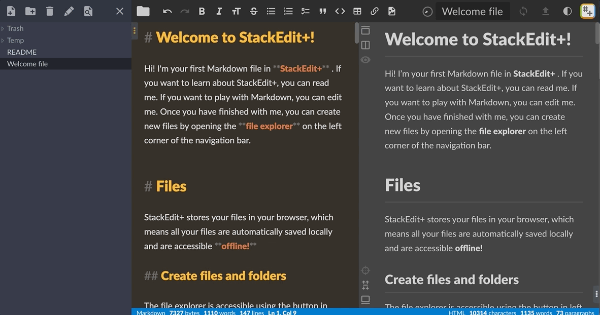
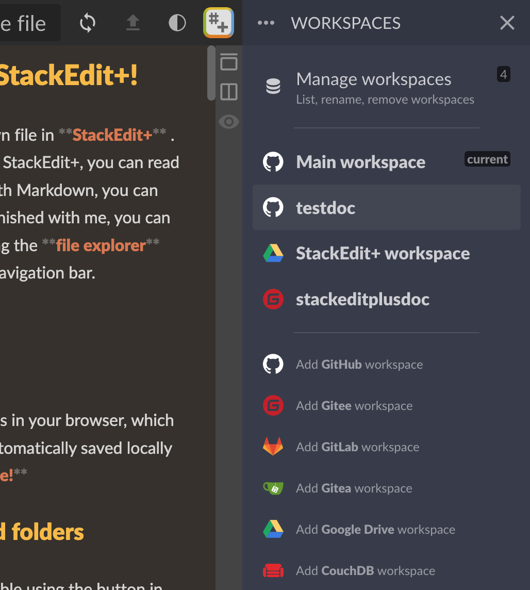
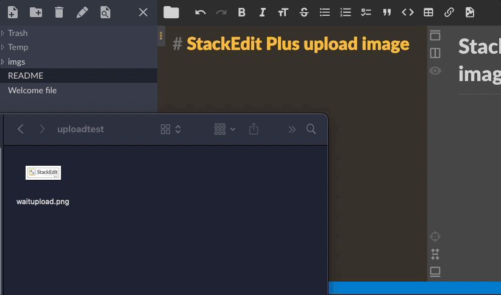
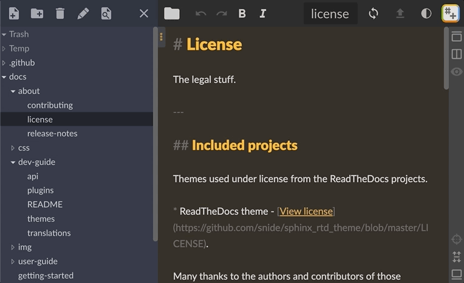

<h1 align="center" style="text-align:center;">

</h1>
<p align="center">
	<strong>Note taking tool, online Markdown editor.</strong><br>
  If you like this project, please click Star, your motivation is definitely the greatest motivation for the author!
</p>
<p align="center">
	<a href="https://stackedit.net/">https://stackedit.net</a>
</p>
<p align="center">
    <a target="_blank" href="https://www.apache.org/licenses/LICENSE-2.0.txt">
		
	</a>
    <a target="_blank" href="https://hub.docker.com/r/mafgwo/stackedit-plus">
		
	</a>
</p>
<br/>
<p align="center">
	<a target="_blank" href="https://twitter.com/StackEditPlus">
	</a>
</p>
<hr />
1.Notes support Git warehouse workspace such as Gitee, GitHub, and Gitea.<br>
2.It supports direct uploading of images, as well as pasting or dragging and uploading of various external image beds (GitHub, Gitea, SM.MS, and custom image beds).<br>
3.The editing area supports selecting themes or customizing, and there are always themes that you like. <br>
4.supports historical version management, without worrying about the inability to rollback after editing overrides.<br>
5.Support for extensions such as KaTeX mathematical expressions, Mermaid UML diagrams, and music scores.
<hr />

## Screenshot

**Light and dark theme switching, editing theme switching**


**Supported workspaces**


**Drag and paste to upload images**


**Support file search**


## Differences compared to the original open source version of stackdit:
- Fixed Github authorization login issue.
- Gitee repo supported (2022-05-25)
- Gitea repo supported (2022-05-25)
- Switch main workspace from Google Drive to GitHub (2022-06-04)
- Support for automatic uploading of SM.MS drawing bed paste/drag images (2022-07-01)
- Support for automatic uploading of Gitea drawing bed paste/drag images (2022-07-02)
- Support for automatic uploading of customized map bed pasting/dragging images (2022-07-04)
- Support for automatic uploading of GitHub graphics bed paste/drag images (2022-07-31)
- Support for one-click theme switching in the upper right corner, complete with dark theme styles (2022-08-07)
- Editing and preview area style optimization (2022-08-10)
- File resource management in the left column supports searching for files (2022-08-17)
- Support for the [TOC] directory (2022-09-04)
- Publishing Support Fill in Submission Information [for Gitee, GitHub, Gitea, Gitlab] (2022-09-10)
- Support automatic synchronization of document space closing [for Gitee, GitHub, Gitea, and Gitlab], and customize submission information after closing (2022-09-23)
- Gitea supports backend configuration to specify application ID and secret (2022-10-03)
- Support for selecting theme styles in the editing area (2022-10-06)
- Supports direct storage of images into the current document space (2022-10-29)
- Support for link jumping between MD documents (2022-11-20)
- Support for selecting theme styles in the preview area (2022-12-04)
- Gitlab support optimization (2023-02-23)
- Exporting HTML and PDF supports export with theme (2023-02-26)
- Support for sharing files (2023-04-06)

## Disadvantages of the original open source version of stackdit:
- Author no longer maintains
- There is a problem with Github authorization login

## Deployment Instructions
> It is recommended to deploy using the docker compose method. If you encounter problems with other deployment methods, please submit an issue.

`docker-compose.yml` content:

```yaml
version: "3.7"
services:
  stackedit:
    image: mafgwo/stackedit-plus:[Docker Hub found the latest version]
    container_name: stackedit-plus
    environment:
      - LISTENING_PORT=8080
      - ROOT_URL=/
      - USER_BUCKET_NAME=[AWS-S3-bucket]
      - DROPBOX_APP_KEY=[Delete-if-no-support-is-required]
      - DROPBOX_APP_KEY_FULL=[Delete-if-no-support-is-required]
      - GITHUB_CLIENT_ID=[Delete-if-no-support-is-required]
      - GITHUB_CLIENT_SECRET=[Delete-if-no-support-is-required]
      - GITEE_CLIENT_ID=[Delete-if-no-support-is-required]
      - GITEE_CLIENT_SECRET=[Delete-if-no-support-is-required]
      - GOOGLE_CLIENT_ID=[Delete-if-no-support-is-required]
      - GOOGLE_API_KEY=[Delete-if-no-support-is-required]
      - GITEA_CLIENT_ID=[Delete-if-no-support-is-required]
      - GITEA_CLIENT_SECRET=[Delete-if-no-support-is-required]
      - GITEA_URL=[Delete-if-no-support-is-required]
      - GITLAB_CLIENT_ID=[Delete-if-no-support-is-required]
      - GITLAB_URL=[Delete-if-no-support-is-required]
    ports:
      - 8080:8080/tcp
    network_mode: bridge
    restart: always
```

Start or stop commands in docker compose mode
```bash
# Start command in the docker-compose.yml file directory
docker-compose up -d
# Stop command in the docker-compose.yml file directory
docker-compose down
```

Alternatively, you can directly start it by naming it Docker. The command is as follows:

```bash
docker run -itd --name stackedit-plus \
  -p 8080:8080 \
  -e LISTENING_PORT=8080 \
  -e ROOT_URL=/ \
  -e USER_BUCKET_NAME=[AWS-S3-bucket] \
  -e DROPBOX_APP_KEY=[Delete-if-no-support-is-required] \
  -e DROPBOX_APP_KEY_FULL=[Delete-if-no-support-is-required] \
  -e GITHUB_CLIENT_ID=[Delete-if-no-support-is-required] \
  -e GITHUB_CLIENT_SECRET=[Delete-if-no-support-is-required] \
  -e GITEE_CLIENT_ID=[Delete-if-no-support-is-required] \
  -e GITEE_CLIENT_SECRET=[Delete-if-no-support-is-required] \
  -e GOOGLE_CLIENT_ID=[Delete-if-no-support-is-required] \
  -e GOOGLE_API_KEY=[Delete-if-no-support-is-required] \
  -e GITEA_CLIENT_ID=[Delete-if-no-support-is-required] \
  -e GITEA_CLIENT_SECRET=[Delete-if-no-support-is-required] \
  -e GITEA_URL=[Delete-if-no-support-is-required] \
  -e GITLAB_CLIENT_ID=[Delete-if-no-support-is-required] \
  -e GITLAB_URL=[Delete-if-no-support-is-required] \
  mafgwo/stackedit-plus:[Docker Hub found the latest version]

```

## How to create a third-party platform application
> During deployment, if you need to support GitHub, Gitea, Gitlab, you need to create an application on the corresponding third-party platform, obtain the application ID and secret key, replace them with the above environment variables, and then start the application.

- Environment variables for GitHub: `GITHUB_CLIENT_ID` `GITEE_CLIENT_SECRET`, **[How to create a GitHub application](./docs/GitHub-Application-Creation.md)**

- Gitea can optionally configure environment variables (if not configured, it is specified at the front end during association, and if configured, only configured application information is allowed): `GITEA_CLIENT_ID` `GITEA_CLIENT_SECRET` `GITEA_URL`, **[How to create a Gitea application](./docs/Gitea-Application-Creation.md)**

- Gitlab can optionally configure environment variables (if not configured, it is specified at the front end during association, and if configured, only configured application information is allowed): `GITLAB_CLIENT_ID` `GITLAB_URL` **How to create a Gitlab application(Documents to be supplemented)**

(Special note: Self built Gitea and Gitlab must support cross domain access to stackdit.)

## Compile and Run
> Select the 11.15.0 version of Nodejs to compile and run

```bash
# Installation Dependencies
npm install

# serve with hot reload at localhost:8080
npm start

# build for production with minification
npm run build

# build for production and view the bundle analyzer report
npm run build --report
```
