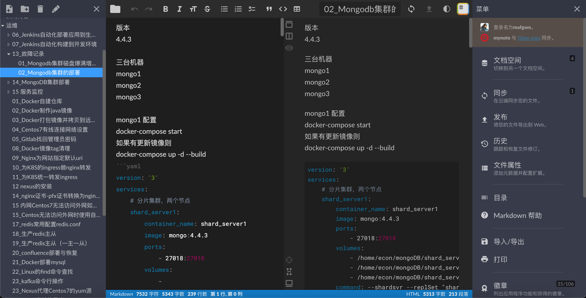
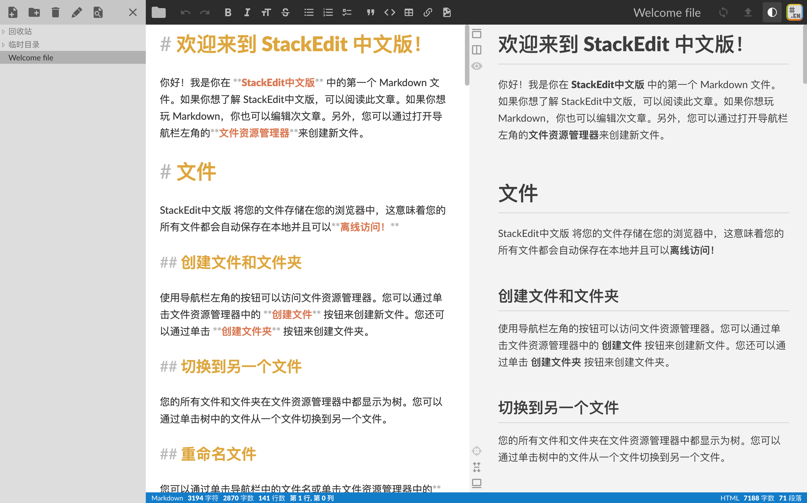
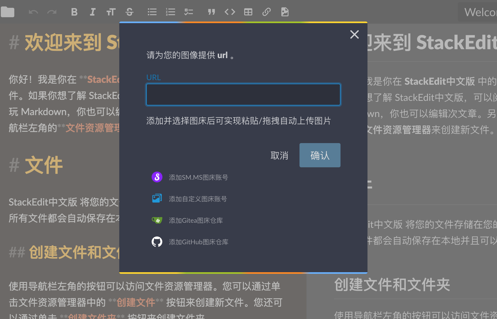
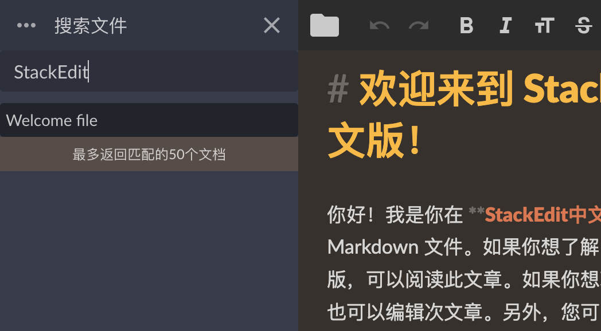

# StackEdit中文版

**StackEdit中文版官方地址：https://stackedit.cn**

如果你喜欢该项目，请点一下Star，您的肯定是作者最大的动力！

StackEdit中文版的docker镜像地址：[mafgwo/stackedit](https://hub.docker.com/r/mafgwo/stackedit)

**示例截图-暗色主题**


**示例截图-亮色主题**


**示例截图-支持的文档空间**


**示例截图-支持的图床**


**示例截图-支持文件搜索**


## 相比国外开源版本的区别：
- 修复了Github授权登录问题
- 支持了Gitee仓库（2022-05-25）
- 支持了Gitea仓库（2022-05-25）
- 汉化（2022-06-01）
- 主文档空间从GoogleDrive切换为Gitee（2022-06-04）
- 支持SM.MS图床粘贴/拖拽图片自动上传（2022-07-01）
- 支持Gitea图床粘贴/拖拽图片自动上传（2022-07-02）
- 支持自定义图床粘贴/拖拽图片自动上传（2022-07-04）
- 支持GitHub图床粘贴/拖拽图片自动上传（2022-07-31）
- 支持了右上角一键切换主题，补全了深色主题的样式（2022-08-07）
- 编辑与预览区域样式优化（2022-08-10）
- 左边栏文件资源管理支持搜索文件（2022-08-17）

## 国外开源版本弊端：
- 作者已经不维护了
- Github授权登录存在问题
- 不支持国内常用Gitee
- 强依赖GoogleDrive，而Google Drive在国内不能正常访问

## 部署说明
> 建议docker-compose方式部署，其他部署方式如遇到问题欢迎提issue。

`docker-compose.yml`如下：

```yaml
version: "3.7"
services:
  stackedit:
    image: mafgwo/stackedit:【docker中央仓库找到最新版本】
    container_name: stackedit
    environment:
      - LISTENING_PORT=8080
      - ROOT_URL=/
      - USER_BUCKET_NAME=root
      - DROPBOX_APP_KEY=【不需要支持则删掉】
      - DROPBOX_APP_KEY_FULL=【不需要支持则删掉】
      - GITHUB_CLIENT_ID=【不需要支持则删掉】
      - GITHUB_CLIENT_SECRET=【不需要支持则删掉】
      - GITEE_CLIENT_ID=【不需要支持则删掉】
      - GITEE_CLIENT_SECRET=【不需要支持则删掉】
      - GOOGLE_CLIENT_ID=【不需要支持则删掉】
      - GOOGLE_API_KEY=【不需要支持则删掉】
    ports:
      - 8080:8080/tcp
    network_mode: bridge
    restart: always
```

启动或停止命令
```bash
# 在 docker-compose.yml 文件目录下 启动命令 
docker-compose up -d
# 在 docker-compose.yml 文件目录下 停止命令 
docker-compose down
# 更新镜像只需要修改docker-compose.yml中镜像版本执行再停止、启动命令即可
```

## 编译与运行
> 编译运行的nodejs版本选择11.15.0版本

```bash
# 安装依赖
npm install

# serve with hot reload at localhost:8080
npm start

# build for production with minification
npm run build

# build for production and view the bundle analyzer report
npm run build --report
```

## 欢迎加群交流
关于StackEdit，如果你有想法，或者使用中遇到了问题，可以提Issue，如果需要快速得到反馈，可以加QQ群如下（加群后可直接@群主）：

