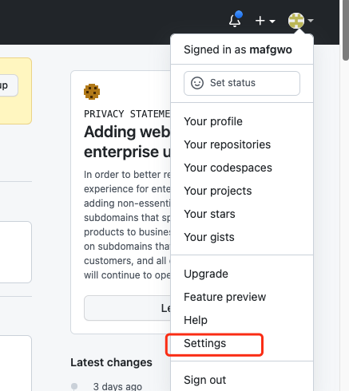
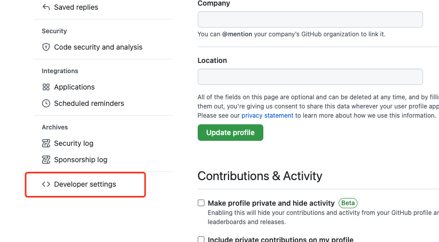
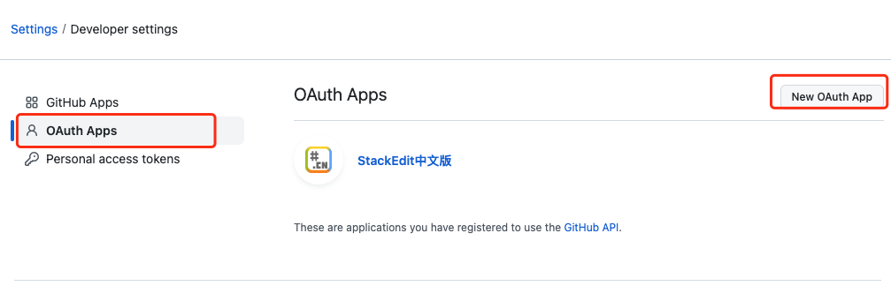
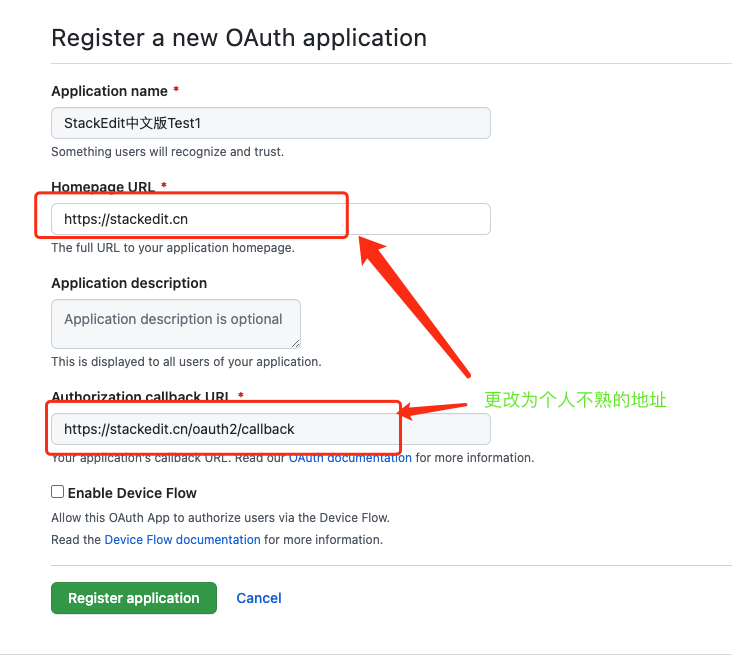
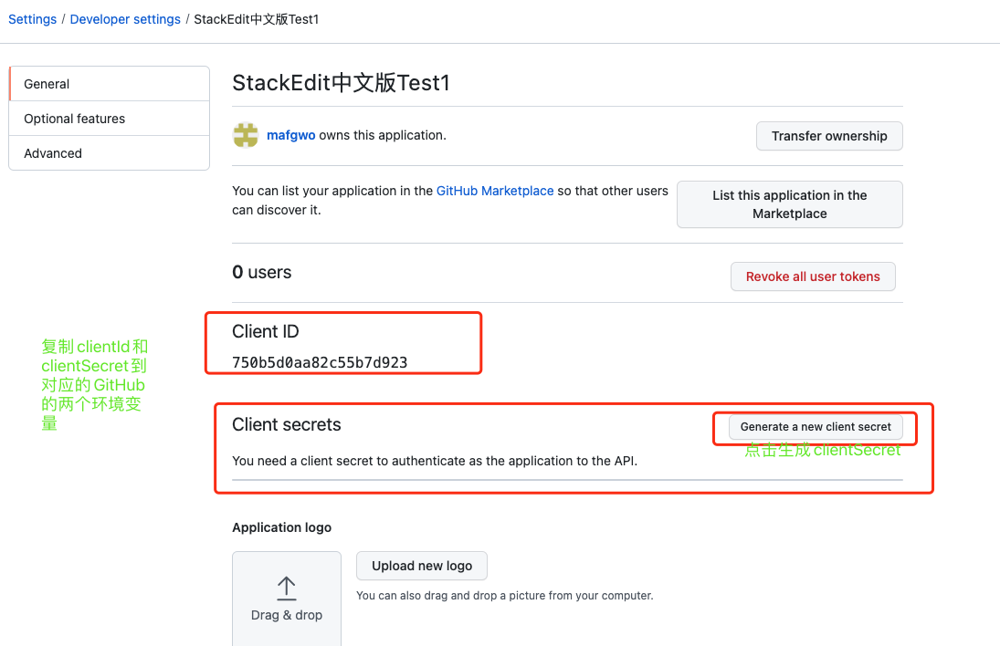

# GitHub Application Configuration Description

> StackEdit+ deployment If you need to support GitHub, you need to create an application in GitHub and copy the clientId and clientSecret therein to populate the environment variable GITHUB_ CLIENT_ ID and GITHUB_ CLIENT_ SECRET.

# How to create a GitHub application

Create as indicated in the following figure:

