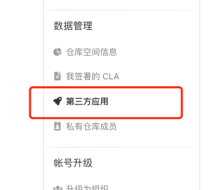
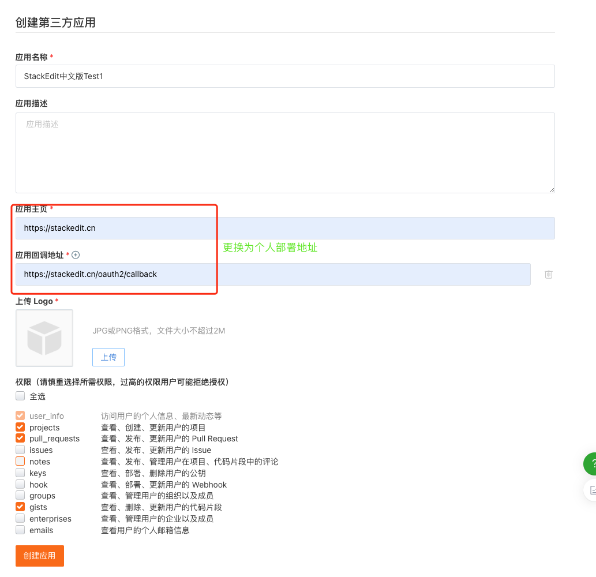

# Gitee应用配置说明

> StackEdit中文版部署如果需要支持Gitee，则需要到Gitee创建一个应用，并复制其中的clientId和clientSecret填充到环境变量 GITEE_CLIENT_ID 和 GITEE_CLIENT_SECRET 中。

# 如何创建Gitee应用

按下面图的指示创建

创建成功后即可看到client id 和 client secret。