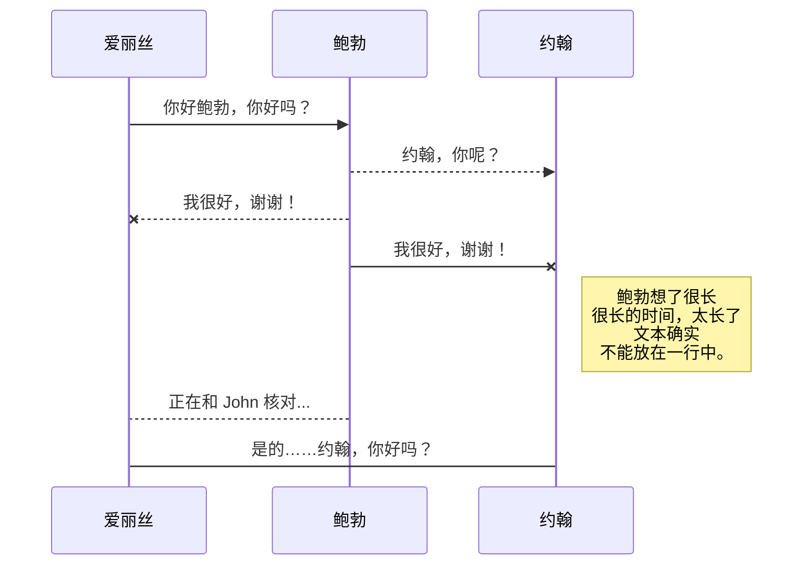
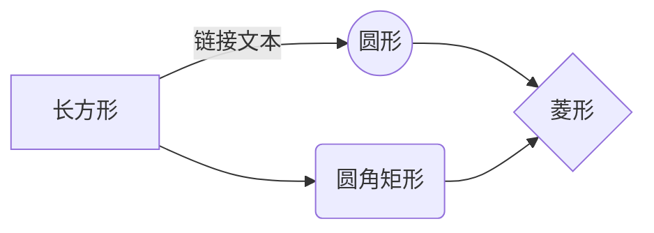

# 欢迎来到 StackEdit 中文版！

你好！我是你在 **StackEdit中文版** 中的第一个 Markdown 文件。如果你想了解 StackEdit中文版，可以阅读此文章。如果你想玩 Markdown，你也可以编辑此文章。另外，您可以通过打开导航栏左边的**文件资源管理器**来创建新文件。

# 文件

StackEdit中文版 将您的文件存储在您的浏览器中，这意味着您的所有文件都会自动保存在本地并且可以**离线访问！**

## 创建文件和文件夹

使用导航栏左边的文件夹图标可以访问文件资源管理器。您可以通过单击文件资源管理器中的 **创建文件** 图标来创建新文件。您还可以通过单击 **创建文件夹** 图标来创建文件夹。

## 切换到另一个文件

您的所有文件和文件夹在文件资源管理器中都显示为树。您可以通过单击树中的文件从一个文件切换到另一个文件。

## 重命名文件

您可以通过单击导航栏中的文件名或单击文件资源管理器中的**重命名**图标来重命名当前文件。

## 搜索文件

您可以通过单击文件资源管理器中的**搜索文件**图标来通过关键字在整个文档空间中搜索文件。

## 删除一个文件

您可以通过单击文件资源管理器中的 **删除** 图标来删除当前文件。该文件将被移至 **回收站** 文件夹并在 7 天不活动后自动删除。

## 导出文件

您可以通过单击菜单中的 **导入/导出** 来导出当前文件。您可以选择将文件导出为纯 Markdown、使用 Handlebars 模板的 HTML 或 PDF。

# 同步

同步是 StackEdit中文版 的最大特点之一。它使您可以将文档空间中的任何文件与存储在**Gitee** 和 **GitHub** 账号中的其他文件同步。这使您可以继续在其他设备上写作，与您共享文件的人协作，轻松集成到您的工作流程中......同步机制在后台每分钟触发一次，下载、合并和上传文件修改。

有两种类型的同步，它们可以相互补充：

- 文档空间同步将自动同步您的所有文件、文件夹和设置。这将允许您在任何其他设备上获取您的文档空间。
> 要开始同步您的文档空间，只需在菜单中使用 Gitee 登录。

- 文件同步将保持文档空间的一个文件与**Gitee**或**GitHub**中的一个或多个文件同步。
> 在开始同步文件之前，您必须在**同步**子菜单中链接一个账号。

## 打开一个文件

您可以通过打开 **同步** 子菜单并单击 **从...打开** 从**Gitee** 或 **GitHub** 打开文件。在文档空间中打开后，文件中的任何修改都将自动同步。

## 保存文件

您可以通过打开 **同步** 子菜单并单击 **在...保存** 将文档空间的任何文件保存到**Gitee** 或 **GitHub**。即使文档空间中的文件已经同步，您也可以将其保存到另一个位置。 StackEdit中文版 可以将一个文件与多个位置和账号同步。

## 同步文件

一旦您的文件链接到同步位置，StackEdit中文版 将通过下载/上传任何修改来定期同步它。如有必要，将执行合并并解决冲突。

如果您刚刚修改了文件并且想要强制同步，请单击导航栏中的 **立即同步** 按钮。

> **注意：** 如果您没有要同步的文件，**立即同步**按钮将被禁用。

## 管理文件同步

由于一个文件可以与多个位置同步，您可以通过单击**同步**子菜单中的**文件同步**列出和管理同步位置。这允许您列出和删除链接到您的文件的同步位置。

# 发布

在 StackEdit中文版 中发布使您可以轻松地在线发布文件。对文件感到满意后，您可以将其发布到不同的托管平台，例如 **Blogger**、**Gitee**、**Gist**、**GitHub**、**WordPress** 和 **Zendesk**。使用 [Handlebars 模板](http://handlebarsjs.com/)，您可以完全控制导出的内容。

> 在开始发布之前，您必须在**发布**子菜单中链接一个账号。

## 发布文件

您可以通过打开 **发布** 子菜单并单击 **发布到** 来发布您的文件。对于某些位置，您可以选择以下格式：

- Markdown：在可以解释的网站上发布 Markdown 文本（例如**GitHub**），
- HTML：通过 Handlebars 模板发布转换为 HTML 的文件（例如在博客上）。

## 更新发布

发布后，StackEdit中文版 会将您的文件链接到该发布，这使您可以轻松地重新发布它。一旦您修改了文件并想要更新您的发布，请单击导航栏中的**立即发布**按钮。

> **注意：** 如果您没有要同步的文件，**立即同步**按钮将被禁用。

## 管理文件同步

由于一个文件可以与多个位置同步，您可以通过单击**同步**子菜单中的**文件同步**列出和管理同步位置。这允许您列出和删除链接到您的文件的同步位置。

# Markdown扩展

StackEdit中文版 通过添加额外的 **Markdown扩展** 扩展了标准 Markdown 语法，为您提供了一些不错的功能。

> **提示：** 您可以在 **文件属性** 对话框中禁用任何 **Markdown 扩展名**。

## SmartyPants

SmartyPants 将 ASCII 标点字符转换为“智能”印刷标点 HTML 实体。例如：

| |ASCII |HTML |
|----------------|--------------------------------| ------------------------------|
|单反引号|`'这不好玩吗？'` |'这不好玩吗？' |
|引用|`“这不好玩吗？”` |“这不好玩吗？” |
|破折号 |`-- 是破折号，--- 是破折号`|-- 是破折号，--- 是破折号|

## KaTeX

您可以使用 [KaTeX](https://khan.github.io/KaTeX/) 渲染 LaTeX 数学表达式：

满足 $\Gamma(n) = (n-1)!\quad\forall n\in\mathbb N$ 的 *Gamma 函数* 是通过欧拉积分

$$
\Gamma(z) = \int_0^\infty t^{z-1}e^{-t}dt\,.
$$

> 您可以在 [这里](http://meta.math.stackexchange.com/questions/5020/mathjax-basic-tutorial-and-quick-reference) 找到有关 **LaTeX** 数学表达式的更多信息。

## UML 图

您可以使用 [Mermaid](https://mermaidjs.github.io/) 渲染 UML 图。例如，这将产生一个序列图：

这将产生一个流程图：

